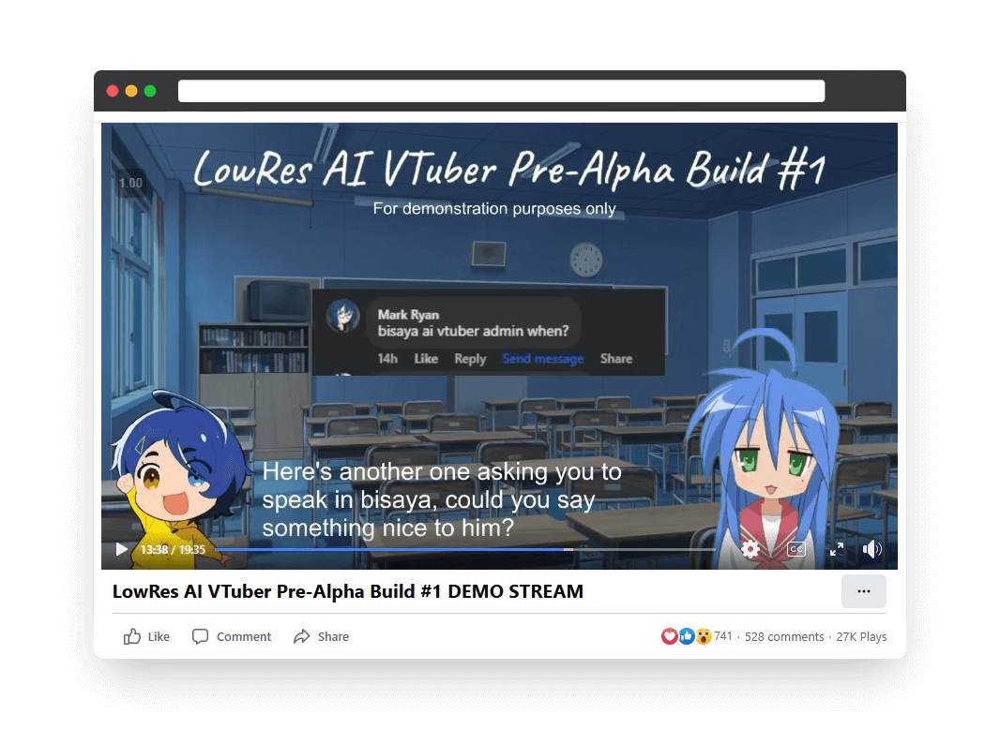

This project involved the development of an advanced AI VTuber (Virtual Streamer) capable of engaging in real-time conversations and responding to chat interactions with a realistic text-to-speech voice. This project provided valuable experience in AI integration, virtual character animation, and real-time systems design for live streaming applications. The primary objective was to create an interactive virtual presence capable of captivating and engaging a live audience.

The AI VTuber's core functionality is implemented using [Python](https://python.org) and utilizes various libraries for natural language processing, speech synthesis, and real-time communication. A key aspect of the project was the creation of a robust pipeline for generating and delivering the VTuber's responses. This pipeline begins with a Large Language Model (LLM) that generates text based on user input. This text is then passed to a text-to-speech (TTS) engine, which synthesizes natural-sounding speech, conveying emotion based on the context.

The VTuber's visual representation is driven by a 2D Live2D model, rendered and animated within [VTube Studio](https://store.steampowered.com/app/1325860/VTube_Studio/). To achieve a seamless and immersive experience, precise lip synchronization between the synthesized speech and the avatar's mouth movements is maintained using virtual audio cables. This ensures that the visual and auditory components of the VTuber's performance are perfectly aligned.

A significant achievement of this project was the successful integration of these complex systems into a cohesive and performant live streaming platform. During its initial demonstration stream, the AI VTuber attracted over **25,000 views** in a single day, demonstrating strong interest and positive reception from the target community. This validates the project's potential for enhancing audience engagement in live streaming environments.

In this project, I gained experience with various tools and technologies, including:
- Programming languages: Python
- Tools: OBS Studio, VTube Studio, Virtual Audio Cables
- Version Control: Git, GitHub

This project demonstrates the potential of AI in enhancing user engagement and provided valuable hands-on experience with virtual streamer development and AI integration.

If you'd like to see the AI VTuber in action, a recording of the demo livestream is embedded here:

<iframe src="https://www.facebook.com/plugins/video.php?height=314&href=https%3A%2F%2Fwww.facebook.com%2Freincarnated.lowres.page%2Fvideos%2F1264760444601381%2F&show_text=true&width=560&t=494" width="560" height="429" style="border:none;overflow:hidden" scrolling="no" frameborder="0" allowfullscreen="true" allow="autoplay; clipboard-write; encrypted-media; picture-in-picture; web-share" allowFullScreen="true"></iframe>