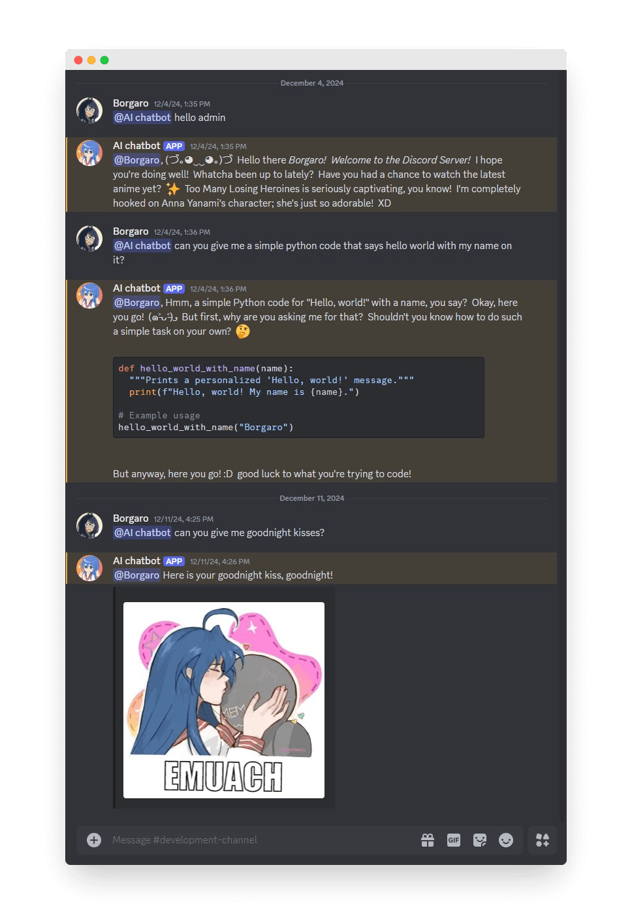

The Discord Chatbot project is an AI-integrated chatbot that I developed as a personal project to enhance user engagement and interaction. This project allowed me to learn how to create dynamic and interactive features within a chatbot environment. The chatbot is designed to cater to a Discord server with up to 10,000 members, ensuring scalability and reliability by handling at least 4,000 concurrent queries and requests.

The chatbot is implemented using [Python](https://python.org) and the [Discord.py](https://discordpy.readthedocs.io/) library. Within a few weeks, I developed a range of features, including personalized conversations tailored to users' preferences and interests.

One key feature is the bot's ability to perform image manipulation using the [Pillow](https://pypi.org/project/pillow/) library, which creates personalized "thank you" notifications for users who boost (sponsor) the Discord server. Additionally, the bot can respond to requests for endearments, such as sending a goodnight kiss with an image and mentioning the user.

For those who enjoy roleplaying and friendly conversations, the chatbot can engage in such scenarios, adding a fun and interactive element to the user experience. This project showcases the integration of AI to create a dynamic and engaging environment for Discord users.

In this project, I gained experience with various tools and technologies, including:
- Programming languages: Python
- Libraries: Discord.py, Pillow, aiohttp
- Frameworks: Flask

This project not only demonstrates the potential of AI in enhancing user engagement but also provided valuable hands-on experience with chatbot development and AI integration.

Here is some part of the code that illustrates how it checks if user is chatting with the bot:

```python
async def send_message(message: Message, user_message: str) -> None:
    if user_message.startswith(bot_name):
        user_message     = user_message[22:].strip()
        author_name:     str = str(message.author)
        author_id:       str = str(message.author.id)
        convo = f'{author_name} : {user_message}'
        try:
            response: str = await rp.get_response(convo, author_id)
            await message.channel.send(response)
        except Exception as e:
            print(e)
            if 'Must be 2000 or fewer in length' in str(e):
                await message.channel.send(f'<@{message.author.id}>, Oops! I can only handle requests under 2000 characters. Try rephrasing your question.')
            else:
                raise e
```
