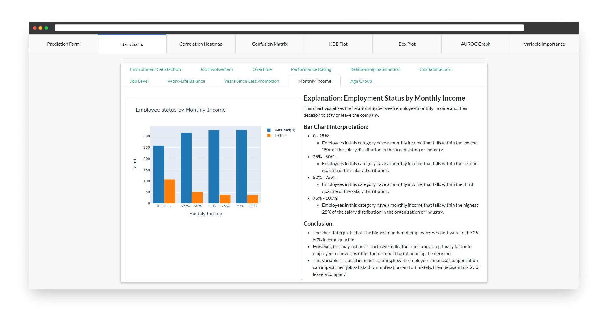

I led the development of an employee retention prediction model using the Random Forest Classifier as part of a research project. This project utilized the IBM HR dataset from Kaggle and involved collaboration with an HR specialist to ensure practical relevance.

Our objective was to address the critical issue of employee retention through machine learning techniques. We sourced data from the IBM HR dataset on Kaggle, which provided comprehensive insights into employee demographics, performance, and turnover.

We developed an interactive web application to enhance the system's usability and accessibility. This web application offers an intuitive interface for users to interact with the model, explore various metrics, and gain insights into the factors driving employee retention. Key features of the web app include visual representations of the model's predictions, such as bar graphs, box plots, univariate analysis (KDE plot, violin plot), confusion matrix, correlation heatmap, and variable importance plots.

Throughout this project, I gained experience with various tools and technologies, including:

- Programming languages: Python

- Libraries: Seaborn, Matplotlib, Plotly, Plotly Dash, Scikit Learn, Pandas

- Framework: Flask

- Development environments: Jupyter Notebook, Google Colab

Combining practical insights from an HR specialist with our technical expertise, this project not only demonstrates the potential of machine learning in tackling real-world business challenges but also provides a valuable tool for organizations to better understand and address employee retention.

Here is some example code to illustrate Simple Schema use:


 
Source: <a href="https://github.com/theVacay/vacay">theVacay/vacay</a>
