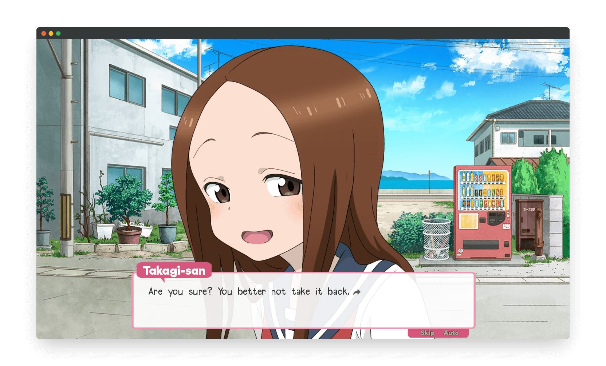

The fan game project based on the "Skilled Teaser Takagi-san" series is a collaborative effort that I led and coordinated as the project lead and programming lead. The project involved a talented international team of 26 individuals, including developers and digital artists. This experience allowed me to learn how to manage a diverse team and ensure the production of high-quality, efficient code that met high standards.

The game is implemented using [Python](https://python.org) and [Ren'Py](https://www.renpy.org/), a visual novel engine. Over several weeks, we developed a polished and engaging visual novel experience that complements the original series' narrative. My role involved supervising the development process and overseeing artistic contributions to ensure seamless integration with the game's story.

Throughout this project, I guided the team through various development tasks and achieved a dynamic and interactive gameplay experience for fans. This collaborative effort showcased our collective creativity and technical skills, resulting in a product that faithfully captured the spirit of the original series.

In this project, I gained experience with various tools and technologies, including:
- Programming languages: Python
- Libraries: Ren'Py
- Platforms: GitHub
- Front-end technologies: HTML, JavaScript, CSS

Here is some example code to illustrate Simple Schema use:


 
Source: <a href="https://github.com/theVacay/vacay">theVacay/vacay</a>
